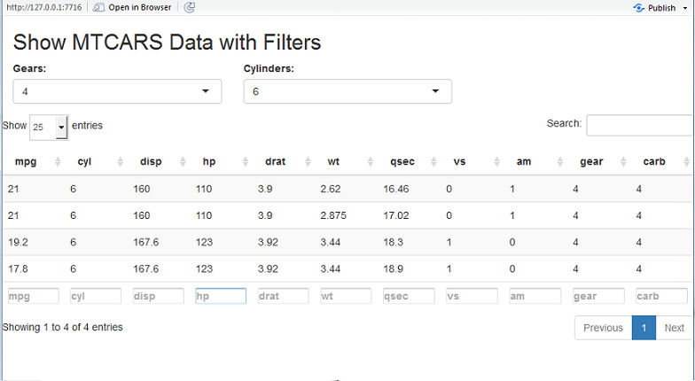

```{r setup, include=FALSE}
knitr::opts_chunk$set(echo = TRUE)

```


## Desciption
Mtcars filters is a tool to easily limit a dataset to only values of interest.  This tools allows you to quickly limit the mtcars dataset by number of cylinders and by number of gears.  The tool usues the DataTable function to allow dispaly the first 25 rows and also allow free text search over the dataset.


## UI.R
```{r, echo=TRUE, message=FALSE, eval=FALSE}
fluidPage(
  # write title
  titlePanel("Show MTCARS Data with Filters"),
  # write select inputs
  fluidRow(
    column(4, selectInput("gear",
                          "Gears:",
                          c("All",
                          unique(as.character(mtcars$gear))))),
    column(4,selectInput("cyl",
                         "Cylinders:",
                         c("All",
                         unique(as.character(mtcars$cyl))))) ),
  # Write table 
  fluidRow(
    dataTableOutput("table"))
)
```


## Server.R
```{r, echo=TRUE, message=FALSE, eval=FALSE}

function(input, output) {
  
  # Filter data based on number of cylinders and number of gears
  output$table <- renderDataTable({
    data <- mtcars
    if (input$cyl != "All") {
      data <- data[data$cyl == input$cyl,]
    }
    if (input$gear != "All") {
      data <- data[data$gear == input$gear,]
    }
    data
  })
}
```


## DataTable used to display and search


